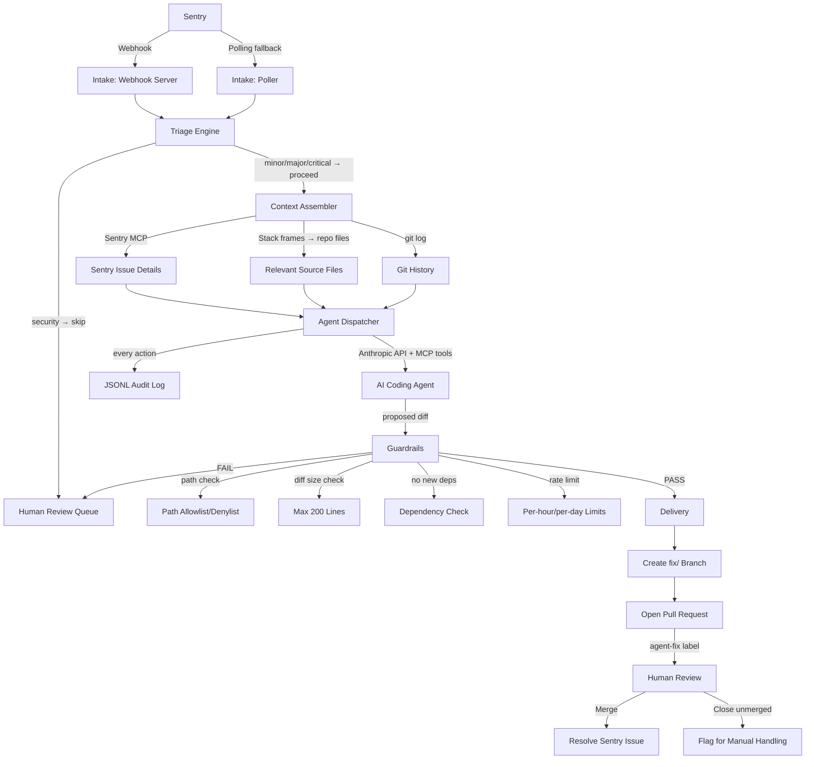

# sentry-bugfix-agent

**An independent open-source project, not affiliated with or endorsed by Sentry (Functional Software, Inc.).**

A production-ready, agent-driven bug-fixing pipeline that connects your Sentry error tracker to AI coding agents via the Model Context Protocol (MCP). When a new error appears in Sentry for a configured staging or development environment, the pipeline automatically triages it, gathers full context (stack trace, source files, git history), dispatches an AI coding agent to produce a fix on a branch, and opens a pull request for human review. Humans only review — the pipeline does everything else.

---

## How this differs from Sentry Seer

[Sentry Seer](https://sentry.io/features/ai-autofix/) is Sentry's own AI bug-fixing feature, deeply integrated into the Sentry product. `sentry-bugfix-agent` takes a different approach:

| | sentry-bugfix-agent | Sentry Seer |
|---|---|---|
| **License** | MIT open source | Vendor feature |
| **Hosting** | Self-hosted in your infra | Sentry cloud |
| **LLM** | Bring your own (Anthropic, configurable) | Sentry-managed |
| **Protocol** | MCP — all agent tools are auditable | Proprietary |
| **Guardrails** | Enforced in code, not in the prompt | Vendor-controlled |
| **Merge policy** | Never merges — human required | Configurable |
| **Target** | Teams wanting full control over agentic tooling | Teams wanting a plug-and-play add-on |

Both are good choices. This project is for teams who want the full pipeline under their own control, with their own LLM keys, their own guardrails, and full auditability.

---

## Architecture



---

## Why guardrails are the hard part

Agentic code generation is powerful but requires serious safety design. The credibility of this project rests entirely on its guardrails — without them, an agent could modify CI pipelines, inject dependencies, or produce unboundedly large diffs that sneak past review.

Every guardrail in this project is **enforced in code and covered by tests**:

**1. Severity routing.** The triage engine classifies every error before the agent sees it. Security-tagged issues are never dispatched to the agent — they go directly to human review. This is not a prompt instruction; it is a hard code gate.

**2. Security-issue exclusion.** Issues matching any security pattern (SQL injection, XSS, auth-related) are classified as `severity: security` and `shouldAutoFix: false`. The pipeline stops there and files the issue for humans. The agent never receives the context.

**3. Path allowlist/denylist.** The agent's diff is parsed to extract every modified file path. Each path is checked against the configured allowlist and denylist using glob matching. Any match against a denied pattern (e.g. `infra/**`, `.github/**`, `**/*.lock`) aborts delivery and files the issue for humans.

**4. Diff size limit.** Changed lines (additions + deletions) are counted. If the diff exceeds the configured limit (default 200 lines), it is rejected. Large diffs are a signal that the fix is too broad to review safely.

**5. No new dependencies.** The diff is scanned for modifications to known dependency manifests (`package.json`, `requirements.txt`, `Gemfile`, `go.mod`, etc.). Any such modification is rejected.

**6. Rate limits.** A sliding-window rate limiter prevents runaway behavior — the pipeline will not dispatch more than N agent runs per hour or per day (both configurable).

**7. No auto-merge, ever.** The pipeline opens PRs with the `agent-fix` label and `require_review` — it cannot merge. The GitHub Actions workflow on `fix/**` branches runs CI and posts a comment, but merging always requires a human.

**8. Full audit log.** Every phase of every run is recorded to a JSONL file: which issue was received, how it was triaged, what context was assembled, every agent turn (input tokens, output tokens, stop reason), which guardrails ran and what they decided, and whether a PR was opened. The audit log ID is embedded in the PR description for traceability.

---

## Quickstart (docker-compose)

### Prerequisites

- Docker and Docker Compose
- A Sentry account with a project (free tier works)
- An Anthropic API key
- A GitHub personal access token with `repo` scope
- A Sentry auth token with `project:read`, `event:read`, `issue:write` scopes

### 1. Configure

```bash
cp bugfix-agent.config.example.yaml bugfix-agent.config.yaml
# Edit bugfix-agent.config.yaml with your Sentry org/project, GitHub repo, etc.
```

### 2. Set environment variables

```bash
export SENTRY_TOKEN=sntrys_...
export SENTRY_WEBHOOK_SECRET=your-webhook-secret
export GITHUB_TOKEN=ghp_...
export ANTHROPIC_API_KEY=sk-ant-...
```

### 3. Start the pipeline

```bash
docker-compose up -d agent
```

### 4. Register the Sentry webhook

In your Sentry project settings, add a webhook pointing to:

```
http://your-server:3000/webhook/sentry
```

With secret matching `SENTRY_WEBHOOK_SECRET`.

### 5. Trigger a demo bug (optional)

```bash
# Start the demo app
docker-compose --profile demo up -d demo-app

# Trigger errors (hits the buggy endpoints)
curl http://localhost:4000/divide?a=10\&b=0
curl http://localhost:4000/user/1

# Seed the pipeline directly (bypasses the real Sentry webhook)
WEBHOOK_SECRET=your-webhook-secret npx tsx demo/seed.ts
```

### 6. Watch the pipeline work

```bash
# Follow logs
docker-compose logs -f agent

# Watch the audit log
tail -f audit.jsonl | jq .
```

A PR will appear in your GitHub repository within minutes.

---

## Configuration reference

Full example: [bugfix-agent.config.example.yaml](bugfix-agent.config.example.yaml)

| Key | Type | Default | Description |
|-----|------|---------|-------------|
| `sentry.token` | string | required | Sentry auth token |
| `sentry.webhookSecret` | string | required | Webhook signature secret |
| `sentry.organization` | string | required | Sentry org slug |
| `sentry.project` | string | required | Sentry project slug |
| `sentry.environments` | string[] | required | Allowed environments (never `production`) |
| `sentry.pollIntervalSeconds` | number | 60 | Polling interval; set 0 to disable |
| `github.token` | string | required | GitHub PAT |
| `github.owner` | string | required | GitHub org or user |
| `github.repo` | string | required | Repository name |
| `github.baseBranch` | string | `main` | Branch to base fix branches on |
| `anthropic.apiKey` | string | required | Anthropic API key |
| `anthropic.model` | string | `claude-opus-4-8` | Model for agent loop |
| `anthropic.maxTokensPerTurn` | number | 8192 | Max tokens per agent turn |
| `guardrails.allowedPaths` | string[] | required | Glob patterns the agent may touch |
| `guardrails.deniedPaths` | string[] | see example | Glob patterns always denied (takes precedence) |
| `guardrails.maxDiffLines` | number | 200 | Max changed lines before aborting |
| `guardrails.maxAgentRunsPerHour` | number | 5 | Hourly rate limit |
| `guardrails.maxAgentRunsPerDay` | number | 20 | Daily rate limit |
| `triage.severity.criticalPatterns` | string[] | [] | Regex → critical severity |
| `triage.severity.majorPatterns` | string[] | [] | Regex → major severity |
| `triage.severity.securityPatterns` | string[] | see example | Regex → security (never auto-fixed) |
| `triage.severity.frequencyThreshold.major` | number | 10 | Events/24h → at least major |
| `triage.severity.frequencyThreshold.critical` | number | 100 | Events/24h → critical |
| `triage.useLlmClassification` | boolean | false | Enable secondary LLM triage pass |
| `audit.logPath` | string | `./audit.jsonl` | JSONL audit log path |
| `server.port` | number | 3000 | Webhook server port |
| `server.host` | string | `0.0.0.0` | Webhook server bind address |

---

## Limitations & non-goals

- **Staging/development only, by design.** The config schema rejects `production` in the environments list. This is a hard constraint — the pipeline is not designed for production error volumes or blast radius.

- **Not a replacement for code review.** AI fixes can be wrong, incomplete, or subtly incorrect. Every PR requires human review. The pipeline exists to save you the time of triaging, gathering context, and drafting an initial fix — not to replace engineering judgment.

- **LLM fixes can be wrong.** That is why review is mandatory, guardrails block the most dangerous operations, and the full audit log is always available. Treat every agent-generated PR as a starting point, not a final answer.

- **No UI.** The interface is: logs, JSONL audit files, and GitHub PRs. This is intentional — the pipeline is infrastructure, not an application.

- **In-memory dedup and rate-limiter.** The default implementations use in-memory state and do not survive restarts. For multi-instance deployments, implement the `DedupStore` interface backed by Redis or a database.

- **Stack frame → file mapping requires the repo to be present.** The pipeline currently resolves file paths against the local filesystem at the configured `repoRoot`. For remote repos, extend the `ContextAssembler` to fetch files via the GitHub API.

---

## Development

```bash
npm install
npm run dev         # tsx watch mode
npm test            # run all tests
npm run test:coverage
npm run lint
npm run format
```

---

## Optional: AWS deployment

A minimal Terraform module for AWS ECS Fargate is in [deploy/terraform/](deploy/terraform/). It deploys the agent as a Fargate service with secrets stored in AWS SSM Parameter Store. See [deploy/terraform/README.md](deploy/terraform/README.md) for usage.

---

## License

MIT © Contributors. See [LICENSE](LICENSE).
