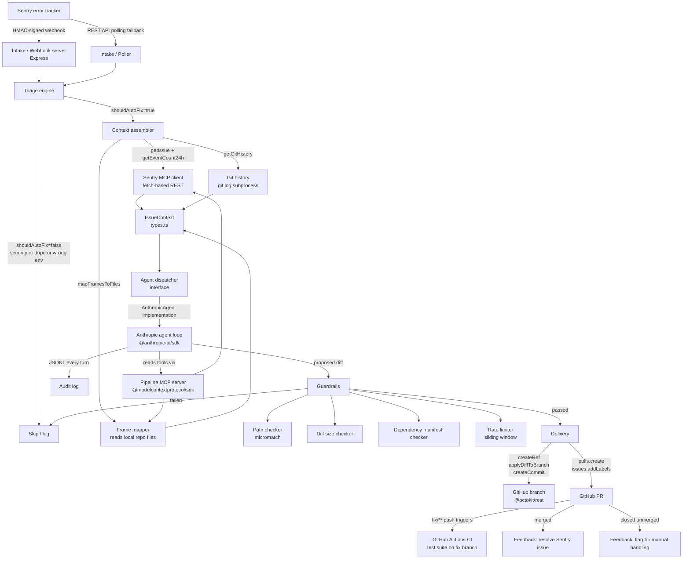

# Architecture

## Overview

`sentry-bugfix-agent` is a Node.js service that orchestrates an AI bug-fixing pipeline. It has no persistent database — state lives in the JSONL audit log, in-memory dedup/rate-limit stores (swappable for Redis), and GitHub pull requests.

## Component diagram

## Data flow

1. **Intake** — the webhook handler verifies the HMAC-SHA256 `sentry-hook-signature`, deserializes the event, checks the environment filter, and hands off to the pipeline. The poller provides a fallback for missed webhooks.

2. **Triage** — the triage engine runs synchronously. It deduplicates against an in-memory set, classifies severity using configurable regex patterns and frequency thresholds, and hard-blocks security issues. The result (`TriageResult`) carries the event, issue stub, severity, and a `shouldAutoFix` flag.

3. **Context assembly** — fetches the full Sentry issue and 24h event count via the Sentry REST API, maps in-app stack frames to actual files on disk, and gathers recent git history for those files. The assembled `IssueContext` is the only input the agent receives.

4. **Agent dispatch** — the `AgentDispatcher` interface decouples the pipeline from any specific agent backend. The default implementation (`AnthropicAgent`) runs a multi-turn conversation with the Anthropic API. Every turn is logged to the JSONL audit trail. The agent also has access to our own MCP server (read-only file access, issue context fetch, diff proposal) so its file operations are mediated and logged.

5. **Guardrails** — after the agent produces a diff, four checks run in order:
   - Dependency manifest check (fail-fast, cheapest)
   - Diff size check
   - Path check (every file in the diff against allowlist/denylist)
   - Rate limit was already consumed at pipeline entry; this is a validation pass

6. **Delivery** — creates a `fix/<issueId>-<slug>` branch off the base branch, commits the diff using the GitHub Trees API (no shell, no clone), and opens a PR with a structured description including the root cause, fix rationale, audit log reference, and a review checklist.

7. **Feedback loop** — a GitHub webhook endpoint on `/webhook/github` listens for `pull_request` events on PRs labeled `agent-fix`. On merge: resolves the Sentry issue via the API. On close-without-merge: logs rejection stats.

## Key design decisions

See [adr/](adr/) for the full records. Summary:

- **ESM + TypeScript strict** — modern module system, no CommonJS dual-publish complexity. Strict type checking catches integration errors at compile time.
- **MCP for agent tool mediation** — all agent file operations go through our MCP server, making them auditable and path-checked. Giving the agent raw shell access would make guardrails impossible.
- **No auto-merge, ever** — enforced by the absence of any merge code path. PRs require human approval.
- **Dependency injection for all external clients** — Sentry client, GitHub client, and Anthropic client are all injected as interfaces, making the full pipeline testable without network calls.
- **JSONL audit log** — append-only, line-delimited JSON. Easy to tail, grep, ship to a log aggregator, or parse programmatically.
